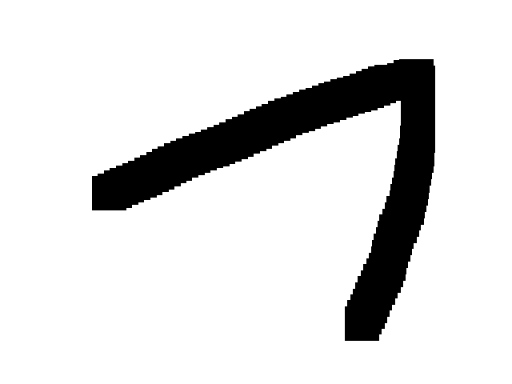

# Test

**Documentation:** <https://ocanevet.github.io/atest/>

**Source code:** <https://github.com/ocanevet/atest>

## Installation

```bash
pip install --extra-index-url https://test.pypi.org/simple/ ztest
```

## Usage

```bash
zsum -a 3 -b 4
```

## Images

This is an example of image to see whether it will be properly updated
on next push on PyPi.


